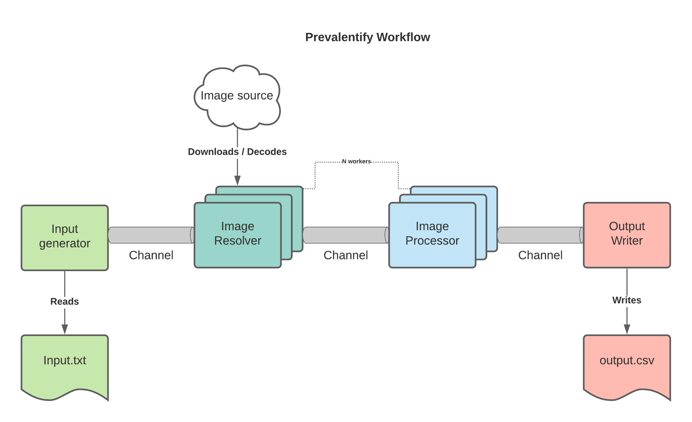

# Prevalentify 

Prevalentify processes a list of images URLS and returns the most prevalent colors 
in RGB hexadecimal format. 

### Usage
The program can be run by providing it with the input and output file path, and 
an optional worker count:
```
cd cmd/prevalentify/
$ go run main.go --input="input.txt" --output="output.csv" --workers=5
2020/10/07 00:33:18 starting to process input.txt
2020/10/07 00:33:19 processing complete, see output results in output.csv

```


### Tests
To run the full test suite:
```
go test -v ./...
```

### Design



Prevalentify at its core is effectively just a concurrent data pipeline with sequential steps / actions that 
are executed in a defined order. Prevalentify is comprised of 4 core components:

##### Input Generator 
The input generator is responsible for generating the data for our pipeline. For our use case, 
this will just be scanning an input file, and piping each image URL to the next stage of the pipeline.

##### Image Resolver
The image resolver receives image URLs from the input generator channel, and is responsible for 
making the HTTP call to download the image, and decoding it into an `image.Image`.

As downloading the image will likely be a bottleneck in the pipeline, we will be distributing the work across 
multiple resolver workers.


##### Image Processor
The Image processor receives decoded images on the Image Resolver channel, and performs the color palette extraction utilizing a k-means clustering algorithm.

Considering k-means clustering is a relatively expensive algorithm, this will likely be a bottleneck too,
and therefore will be distributed across multiple processing workers as well.

For the sake of brevity, we will be leveraging the [prominentcolor](https://github.com/EdlinOrg/prominentcolor) library to implement the actual k-means clustering, though the pipeline can make
use of an injected process function.

##### Output Writer
The output writer is the final step in the pipeline, it receives the results from the image processor channel,
and writes the results to defined output file.


### Open Questions / Raw Thoughts
1. How can we ensure optimal resource utilization? 
    * Dynamically resize the worker pool based on the available memory?
    * Implement some pre-processing benchmarking process to determine the ideal worker pool size?
    * Best-effort guesses, allow user to manually configure pool sizes depending on the environment.
    
2. How should we be propagating errors?
    * Utilize a global logger and just handle errors in place?
    * Pass in an error channel to each step, pipe errors to a logging worker?
        * If each step is sharing a global error channel, when can we safely close the channel? Do we need to close it?
    * Have each step return an output channel + an error channel, utilize a fan-in log writer, each step can terminate its 
    own error channel.
    
    
3. How can we leverage some form of caching to avoid re-processing duplicate images?
    * Unbounded cache size will likely cause OOM crashes, how can we determine the ideal cache size?
    * Do we cache at each step, or implement a global cache that can act as a pipeline "circuit breaker"?
    * At what point does a cache do more harm than good? Depending on the data / eviction policy, 
    it's possible the cache is never hit and just consumes valuble memory.
    
4. How should we be determining the most "prevalent" color?
    * Naive approach: just iterate through each pixel and maintain a max-heap of color->count. 
        * The heap can grow quite large, especially if there's a lot of color variance
        * There are 16777216 possible RGB values, keeping a count of each individual color would be costly
        * Returned colors won't necessarily relate to the perceptual color
        * Looping through each pixel can be costly
        
    * Improved solution:
        * Downsample the image to save on cpu cycles 
        * Group "similar" colors, (euclidian distance perhaps?) to avoid keeping a counter for each individual RGB color
        
    * K-means(++) clustering
        * Non deterministic output
    
5. How should we be testing this pipeline?
    * Unit tests at each individual step
    * Integration tests
        * Input Generator reading from a file
        * Image Resolver downloading files from a server
        * Output Writer writing to a file
    * Smoke tests testing the pipeline end-to-end